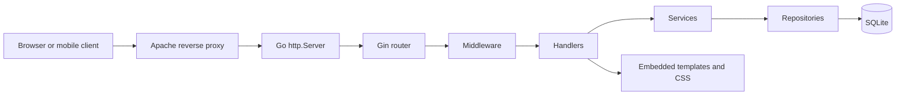

# Architecture

Ty2Shorten URL is a small server-rendered Go application. It owns first-run setup, administrator authentication, settings, short-link management, public landing page rendering, mobile app redirects, and custom short-link redirects.

## Request Flow



## Main Packages

- `cmd/server`: process startup, config loading, database migration, HTTP server, graceful shutdown.
- `internal/server`: Gin router, template parsing, embedded static assets, route composition.
- `internal/middleware`: recovery, logging, security headers, request limits, setup gate, auth guard, CSRF guard.
- `internal/handlers`: request parsing, response selection, template rendering.
- `internal/services`: business rules for setup, auth, settings, links, account, dashboard, and redirects.
- `internal/repositories`: GORM persistence boundaries.
- `internal/session`: signed auth and CSRF cookies.
- `internal/validation`: reusable slug and URL validation.

## Dependency Direction

Handlers depend on services. Services depend on repositories and validators. Repositories depend on GORM models. Lower layers do not depend on handlers.

## Server-Rendered Architecture

HTML is generated by Go `html/template`. CSS and templates are embedded with Go `embed`, so the binary can run without separate template or asset files.

## Database Usage

SQLite is external storage. GORM AutoMigrate creates and updates the current schema at startup. WAL mode, busy timeout, foreign keys, and a constrained connection pool are configured for small single-instance deployments.

## Session Flow

Successful login writes a signed cookie containing the admin ID, expiry, and nonce. Logout clears it. Password change rotates it. CSRF uses a separate signed cookie plus hidden form field.

## Redirect Resolution

`/android` and `/apple` read configured app URLs. `/get` uses simple User-Agent matching. `/r/:slug` normalizes and validates slugs, resolves an active link, increments clicks, and redirects with HTTP 307.

## Deployment Architecture

Production is intended as:

```text
Internet -> Apache TLS/reverse proxy -> 127.0.0.1:8722 -> Ty2Shorten binary -> SQLite file
```
