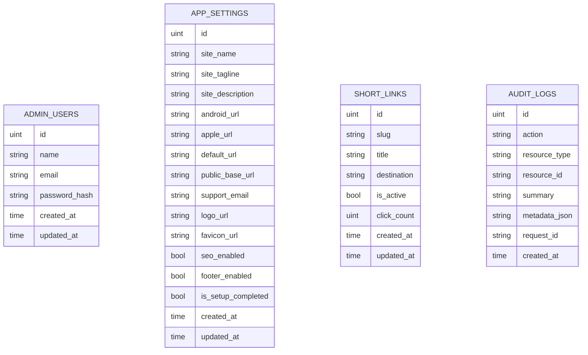

# Database

Ty2Shorten URL uses SQLite by default through GORM and can optionally use MySQL after database bootstrap.

## Location

Before bootstrap, the default SQLite path is initialized from `DATABASE_PATH`. After bootstrap, the selected database is loaded from `APP_CONFIG_PATH`.

```text
./storage/ty2shorten.db
```

Production recommendation:

```text
/var/lib/ty2shorten/ty2shorten.db
```

## Tables



## Startup Behavior

The database directory is created automatically. GORM AutoMigrate runs on startup.

## SQLite Settings

- WAL mode.
- Busy timeout.
- Foreign keys enabled.
- One open connection and one idle connection.

## MySQL Settings

MySQL uses the Go MySQL driver's configuration helper for DSN escaping. Defaults include `utf8mb4`, `parseTime=true`, local timezone handling, a strict connection timeout, bounded open/idle connections, and connection lifetime settings.

See [database configuration](database-configuration.md) for bootstrap file details.

## Backups

Use SQLite `.backup` for live backups. Account for WAL mode and avoid copying only the main `.db` file while the service is running.

## Migration Limitations

There is no dedicated migration versioning system yet. Add one before complex schema evolution.
